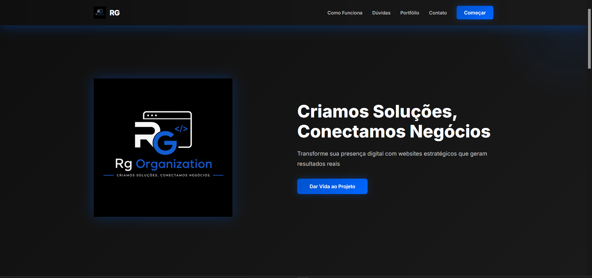

# RG Organization
 

 
Lading page para a RG Organization - uma empresa especializada em criar soluções web que geram resultados reais para negócios. O site apresenta os serviços, explica como funciona, responde dúvidas frequentes e facilita o contato com potenciais clientes.
 
---
 
## 📑 Seções do Site
 
### **1. Navbar (Menu)**
Menu no topo do site com links para navegação rápida entre as seções. Inclui o logo da RG e um botão "Começar" que leva direto para contato.
 
### **2. Hero (Início)**
Seção de destaque com a logo da RG, o lema "Criamos Soluções, Conectamos Negócios" e uma chamada para ação principal. Deixa claro de imediato quem somos.
 
### **3. Como Funciona**
Explica visualmente como funciona a criação de um website profissional. Mostra uma imagem de exemplo e dois pontos principais sobre a importância de ter um site para empresa.
 
### **4. Dúvidas Frequentes (FAQ)**
Accordion interativo com respostas às perguntas mais comuns:
- Qual é o prazo de entrega?
- Como funciona o suporte?
- Qual é o custo?
- O site é responsivo?
### **5. Portfólio**
Galeria com exemplos de projetos realizados pela agência. Mostra os trabalhos anteriores e a qualidade do trabalho entregue.
 
### **6. Contato**
Seção com informações de contato (email e telefone) e formulário para que clientes possam enviar mensagens diretamente.
 
### **7. Footer**
Rodapé com informações legais e copyright.
 
---
 
## 🎨 Design
 
- **Cores**: Azul (#0052CC), Preto e Branco - cores da logo RG
- **Estilo**: Moderno e profissional com efeitos glow azuis sutis
- **Responsividade**: Funciona perfeitamente em desktop, tablet e mobile
---
**Desenvolvido com Bootstrap 5 e boas práticas web.**
